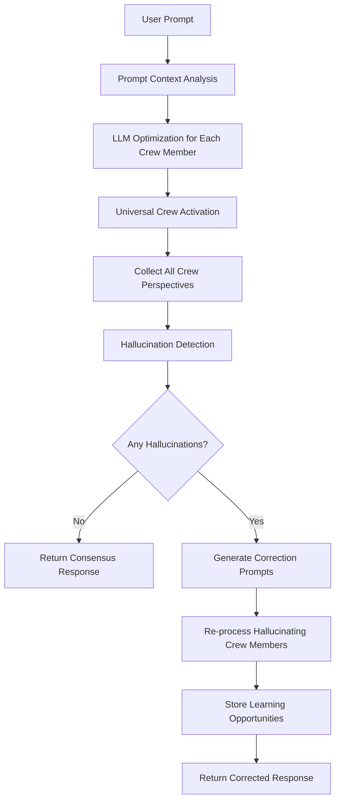

# 🛡️ **ALEX AI ANTI-HALLUCINATION SYSTEM**
**Advanced Multi-LLM Crew-Based Hallucination Prevention**

**Version**: 1.0.0  
**Date**: January 18, 2025  
**Purpose**: Comprehensive hallucination prevention using crew-based consensus and LLM optimization

---

## 🎯 **SYSTEM OVERVIEW**

The Alex AI Anti-Hallucination System leverages the crew's collective intelligence to prevent and correct hallucinations through a sophisticated multi-layered approach that combines LLM optimization, crew consensus validation, and adaptive learning.

### **🛡️ Core Principles**
- **Multi-LLM Optimization**: Dynamic LLM selection based on prompt context and crew member expertise
- **Crew Consensus Validation**: All crew members provide perspectives on every prompt
- **Hallucination Detection**: Automatic identification of responses that deviate from crew consensus
- **Adaptive Learning**: Hallucinations become learning opportunities stored in RAG memories

---

## 🏗️ **ARCHITECTURE COMPONENTS**

### **1. 🎯 Dynamic LLM Optimization System**

#### **OpenRouter-Based LLM Selection**
```typescript
interface LLMOptimizationConfig {
  crewMember: string;
  promptContext: string;
  personaSkills: string[];
  optimalLLM: string;
  confidence: number;
  reasoning: string;
}

class LLMOptimizer {
  selectOptimalLLM(crewMember: string, prompt: string): LLMOptimizationConfig {
    // Analyze prompt context and crew member expertise
    const context = this.analyzePromptContext(prompt);
    const skills = this.getCrewMemberSkills(crewMember);
    
    // Use OpenRouter to find optimal LLM
    const optimalLLM = this.queryOpenRouter(context, skills);
    
    return {
      crewMember,
      promptContext: context,
      personaSkills: skills,
      optimalLLM,
      confidence: this.calculateConfidence(context, optimalLLM),
      reasoning: this.generateReasoning(optimalLLM, context, skills)
    };
  }
}
```

#### **Crew-Specific LLM Optimization Examples**
```bash
# Counselor Troi - Empathy and Psychology Focus
Prompt: "Analyze user experience issues in our application"
Optimal LLM: Claude Opus (excellent at empathy and psychological analysis)
Reasoning: "Claude Opus excels at understanding human emotions and UX psychology"

# Commander Data - Technical Analysis
Prompt: "Optimize this machine learning algorithm"
Optimal LLM: GPT-4 Turbo (superior technical reasoning)
Reasoning: "GPT-4 Turbo provides excellent technical analysis and code optimization"

# Lieutenant Worf - Security Assessment
Prompt: "Conduct security audit of this API"
Optimal LLM: Claude Sonnet (strong security analysis capabilities)
Reasoning: "Claude Sonnet excels at security analysis and threat assessment"

# Captain Picard - Strategic Planning
Prompt: "Develop long-term project strategy"
Optimal LLM: Claude Opus (excellent strategic thinking)
Reasoning: "Claude Opus provides superior strategic planning and leadership insights"
```

### **2. 👥 Universal Crew Activation System**

#### **All Crew Perspective Collection**
```typescript
interface CrewPerspective {
  crewMember: string;
  response: string;
  llmUsed: string;
  confidence: number;
  timestamp: Date;
  context: string;
}

class UniversalCrewActivation {
  async collectAllPerspectives(prompt: string): Promise<CrewPerspective[]> {
    const crewMembers = this.getAllCrewMembers();
    const perspectives: CrewPerspective[] = [];
    
    // Activate all crew members simultaneously
    const crewPromises = crewMembers.map(async (member) => {
      const optimization = await this.llmOptimizer.selectOptimalLLM(member, prompt);
      const response = await this.processWithOptimizedLLM(member, prompt, optimization);
      
      return {
        crewMember: member,
        response: response.content,
        llmUsed: optimization.optimalLLM,
        confidence: response.confidence,
        timestamp: new Date(),
        context: prompt
      };
    });
    
    return await Promise.all(crewPromises);
  }
}
```

#### **N8N Workflow Integration**
```json
{
  "name": "Universal Crew Activation",
  "nodes": [
    {
      "name": "Prompt Analysis",
      "type": "n8n-nodes-base.function",
      "parameters": {
        "functionCode": "// Analyze prompt context and activate all crew members"
      }
    },
    {
      "name": "LLM Optimization",
      "type": "n8n-nodes-base.openRouter",
      "parameters": {
        "model": "dynamic",
        "crewMember": "{{$json.crewMember}}",
        "context": "{{$json.promptContext}}"
      }
    },
    {
      "name": "Crew Response Collection",
      "type": "n8n-nodes-base.merge",
      "parameters": {
        "mode": "combine",
        "combineBy": "combineAll"
      }
    }
  ]
}
```

### **3. 🔍 Hallucination Detection System**

#### **Consensus-Based Validation**
```typescript
interface HallucinationAnalysis {
  crewMember: string;
  isHallucination: boolean;
  deviationScore: number;
  consensusAlignment: number;
  correctionPrompt: string;
  learningOpportunity: string;
}

class HallucinationDetector {
  analyzeCrewConsensus(perspectives: CrewPerspective[]): HallucinationAnalysis[] {
    const consensus = this.calculateConsensus(perspectives);
    const analyses: HallucinationAnalysis[] = [];
    
    perspectives.forEach((perspective) => {
      const deviationScore = this.calculateDeviation(perspective, consensus);
      const isHallucination = deviationScore > this.hallucinationThreshold;
      
      analyses.push({
        crewMember: perspective.crewMember,
        isHallucination,
        deviationScore,
        consensusAlignment: 1 - deviationScore,
        correctionPrompt: this.generateCorrectionPrompt(perspective, consensus),
        learningOpportunity: this.identifyLearningOpportunity(perspective, consensus)
      });
    });
    
    return analyses;
  }
  
  calculateConsensus(perspectives: CrewPerspective[]): CrewPerspective {
    // Use semantic similarity and content analysis
    // to determine the most aligned response
    return this.findMostAlignedResponse(perspectives);
  }
}
```

#### **Deviation Scoring Algorithm**
```typescript
class DeviationCalculator {
  calculateDeviation(perspective: CrewPerspective, consensus: CrewPerspective): number {
    const semanticSimilarity = this.calculateSemanticSimilarity(
      perspective.response, 
      consensus.response
    );
    
    const factualAlignment = this.calculateFactualAlignment(
      perspective.response, 
      consensus.response
    );
    
    const confidenceWeight = this.calculateConfidenceWeight(
      perspective.confidence,
      consensus.confidence
    );
    
    // Weighted deviation score (0-1, where 1 is maximum deviation)
    return 1 - ((semanticSimilarity * 0.4) + (factualAlignment * 0.4) + (confidenceWeight * 0.2));
  }
}
```

### **4. 🔄 Hallucination Correction System**

#### **Crew-Informed Correction**
```typescript
class HallucinationCorrector {
  async correctHallucination(
    hallucinatingMember: string,
    originalResponse: string,
    consensus: CrewPerspective,
    crewInsights: CrewPerspective[]
  ): Promise<CorrectedResponse> {
    
    // Generate correction prompt using crew insights
    const correctionPrompt = this.generateCorrectionPrompt(
      hallucinatingMember,
      originalResponse,
      consensus,
      crewInsights
    );
    
    // Re-process with correction
    const correctedResponse = await this.reprocessWithCorrection(
      hallucinatingMember,
      correctionPrompt
    );
    
    // Store learning opportunity
    await this.storeLearningOpportunity(
      hallucinatingMember,
      originalResponse,
      correctedResponse,
      crewInsights
    );
    
    return correctedResponse;
  }
  
  generateCorrectionPrompt(
    member: string,
    originalResponse: string,
    consensus: CrewPerspective,
    crewInsights: CrewPerspective[]
  ): string {
    return `
    ${this.getCrewMemberPersona(member)}: Your previous response deviated significantly from the crew consensus.
    
    Original Response: ${originalResponse}
    
    Crew Consensus: ${consensus.response}
    
    Crew Insights:
    ${crewInsights.map(insight => 
      `${insight.crewMember}: ${insight.response}`
    ).join('\n')}
    
    Please revise your response to align with the crew consensus while maintaining your unique perspective and expertise. Focus on the factual accuracy and logical consistency identified by your crew members.
    `;
  }
}
```

### **5. 📚 Adaptive Learning System**

#### **RAG Memory Integration**
```typescript
interface HallucinationLearning {
  crewMember: string;
  originalResponse: string;
  correctedResponse: string;
  deviationScore: number;
  learningContext: string;
  crewInsights: CrewPerspective[];
  timestamp: Date;
}

class HallucinationLearningSystem {
  async storeHallucinationLearning(learning: HallucinationLearning): Promise<void> {
    // Store in RAG memory system
    await this.ragMemory.store({
      type: 'hallucination-correction',
      crewMember: learning.crewMember,
      content: {
        original: learning.originalResponse,
        corrected: learning.correctedResponse,
        deviation: learning.deviationScore,
        context: learning.learningContext,
        crewInsights: learning.crewInsights
      },
      metadata: {
        timestamp: learning.timestamp,
        learningType: 'hallucination-prevention',
        confidence: this.calculateLearningConfidence(learning)
      }
    });
  }
  
  async retrieveHallucinationPatterns(crewMember: string): Promise<HallucinationLearning[]> {
    // Query RAG for similar hallucination patterns
    return await this.ragMemory.query({
      type: 'hallucination-correction',
      crewMember,
      similarity: 0.8
    });
  }
}
```

---

## 🔧 **IMPLEMENTATION WORKFLOW**

### **1. Prompt Processing Pipeline**


### **2. N8N Workflow Configuration**
```json
{
  "name": "Anti-Hallucination Crew Workflow",
  "nodes": [
    {
      "name": "Prompt Interception",
      "type": "n8n-nodes-base.webhook",
      "parameters": {
        "httpMethod": "POST",
        "path": "anti-hallucination"
      }
    },
    {
      "name": "LLM Optimization",
      "type": "n8n-nodes-base.function",
      "parameters": {
        "functionCode": "// Optimize LLM selection for each crew member"
      }
    },
    {
      "name": "Crew Activation",
      "type": "n8n-nodes-base.splitInBatches",
      "parameters": {
        "batchSize": 9,
        "options": {}
      }
    },
    {
      "name": "Hallucination Detection",
      "type": "n8n-nodes-base.function",
      "parameters": {
        "functionCode": "// Analyze crew consensus and detect deviations"
      }
    },
    {
      "name": "Correction Processing",
      "type": "n8n-nodes-base.if",
      "parameters": {
        "conditions": {
          "string": [
            {
              "value1": "{{$json.hasHallucinations}}",
              "operation": "equal",
              "value2": "true"
            }
          ]
        }
      }
    },
    {
      "name": "Learning Storage",
      "type": "n8n-nodes-base.supabase",
      "parameters": {
        "operation": "insert",
        "table": "hallucination_learning"
      }
    }
  ]
}
```

### **3. CLI Integration**
```bash
# Enable anti-hallucination system
alexi init --anti-hallucination-enabled

# Configure hallucination detection threshold
alexi config set hallucination-threshold 0.3

# View hallucination learning history
alexi hallucination-history --crew-member "Commander Data"

# Test anti-hallucination system
alexi test anti-hallucination --prompt "Explain quantum computing"

# Monitor hallucination patterns
alexi monitor hallucination-patterns --time-range "last-week"
```

---

## 📊 **MONITORING & ANALYTICS**

### **Hallucination Metrics**
```typescript
interface HallucinationMetrics {
  totalPrompts: number;
  hallucinationsDetected: number;
  hallucinationsCorrected: number;
  averageDeviationScore: number;
  crewMemberAccuracy: Record<string, number>;
  llmPerformance: Record<string, number>;
  learningEffectiveness: number;
}

class HallucinationMonitor {
  async generateMetrics(timeRange: DateRange): Promise<HallucinationMetrics> {
    const hallucinations = await this.getHallucinationsInRange(timeRange);
    
    return {
      totalPrompts: await this.getTotalPrompts(timeRange),
      hallucinationsDetected: hallucinations.length,
      hallucinationsCorrected: hallucinations.filter(h => h.corrected).length,
      averageDeviationScore: this.calculateAverageDeviation(hallucinations),
      crewMemberAccuracy: await this.calculateCrewAccuracy(timeRange),
      llmPerformance: await this.calculateLLMPerformance(timeRange),
      learningEffectiveness: await this.calculateLearningEffectiveness(timeRange)
    };
  }
}
```

### **Dashboard Commands**
```bash
# View hallucination dashboard
alexi hallucination-dashboard

# Export hallucination analytics
alexi export hallucination-analytics --format json --time-range "last-month"

# Generate hallucination report
alexi report hallucination-analysis --detailed --include-recommendations
```

---

## 🎯 **BENEFITS & IMPACT**

### **🛡️ Hallucination Prevention**
- **Multi-LLM Validation**: Each crew member uses optimal LLM for their expertise
- **Consensus-Based Correction**: Automatic detection and correction of deviations
- **Adaptive Learning**: Continuous improvement through RAG memory integration

### **📈 System Reliability**
- **Higher Accuracy**: Collective intelligence reduces individual errors
- **Consistent Quality**: Crew consensus ensures reliable responses
- **Learning Evolution**: System improves over time through hallucination learning

### **🔧 Operational Benefits**
- **Transparent Process**: Clear visibility into crew decision-making
- **Audit Trail**: Complete record of corrections and learning opportunities
- **Performance Monitoring**: Detailed analytics on hallucination patterns

---

## 🚀 **FUTURE ENHANCEMENTS**

### **Advanced Features**
- **Real-time Hallucination Detection**: Instant detection during response generation
- **Predictive Hallucination Prevention**: ML models to predict potential hallucinations
- **Cross-Crew Learning**: Crew members learning from each other's corrections
- **Hallucination Pattern Analysis**: Advanced analytics for hallucination trends

### **Integration Opportunities**
- **External Validation**: Integration with external fact-checking services
- **Domain-Specific Validation**: Specialized validation for technical domains
- **User Feedback Integration**: Incorporating user corrections into learning system

---

## 📚 **IMPLEMENTATION GUIDE**

### **Phase 1: Foundation**
1. Implement LLM optimization system
2. Set up universal crew activation
3. Create basic hallucination detection

### **Phase 2: Advanced Detection**
1. Implement consensus calculation algorithms
2. Add deviation scoring system
3. Create correction prompt generation

### **Phase 3: Learning Integration**
1. Integrate with RAG memory system
2. Implement learning opportunity storage
3. Add hallucination pattern analysis

### **Phase 4: Monitoring & Analytics**
1. Create hallucination monitoring dashboard
2. Implement analytics and reporting
3. Add performance optimization

---

**🖖 This anti-hallucination system represents a sophisticated approach to ensuring AI reliability through collective intelligence and adaptive learning.**

---

*Generated on January 18, 2025*  
*Alex AI Universal Project*  
*Anti-Hallucination System Version: 1.0.0*
