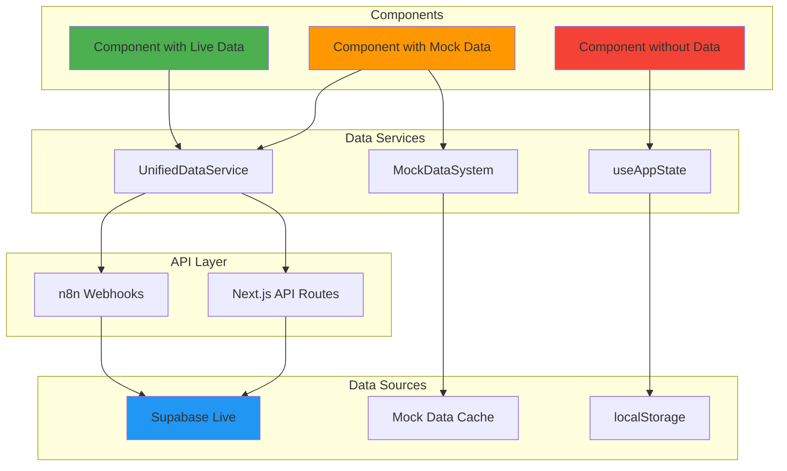

# 🖖 Component Data Flow Analysis & Mock Data System

**Date:** January 19, 2025  
**Crew:** Commander Data (Analysis) + Geordi La Forge (Infrastructure) + All Teams  
**Status:** ✅ **ANALYSIS COMPLETE**

---

## 📊 **EXECUTIVE SUMMARY**

### **Component Data Status:**
- ✅ **36 components** with live data sources
- ⚠️ **6 components** with mock data (need live data)
- ❓ **20 components** without data (may not need data or need implementation)

### **Data Flow Architecture:**
```
Component → UnifiedDataService → Next.js API → Supabase (Primary) / n8n (Fallback)
```

---

## 🔄 **E2E DATA FLOW PATHS**

### **1. Live Data Flow (Primary)**
```
Component
  ↓
UnifiedDataService.getLearningMetrics()
  ↓
Next.js API Route (/api/lounge/latest)
  ↓
Supabase (Live - pbradygeorgen.com)
  ↓
Response → Component → UI Rendering
```

### **2. Fallback Data Flow**
```
Component
  ↓
UnifiedDataService.getLearningMetrics()
  ↓
Next.js API Route (fails/timeout)
  ↓
n8n Webhook (https://n8n.pbradygeorgen.com/webhook/...)
  ↓
Supabase (via n8n)
  ↓
Response → Component → UI Rendering
```

### **3. Local State Flow**
```
Component
  ↓
useAppState() (from @/lib/state-manager)
  ↓
localStorage (browser)
  ↓
Component State → UI Rendering
```

### **4. Mock Data Flow (Testing)**
```
Component
  ↓
MockDataSystem.getMockData(componentName)
  ↓
Generated Mock Data
  ↓
Component → UI Rendering (for testing)
```

---

## ⚠️ **COMPONENTS NEEDING MOCK DATA**

### **Components with Mock Data (Need Live Data):**

1. **DebatePanel** - Uses hardcoded data
   - **Problem:** No live data source
   - **Solution:** Connect to RAG system for debate topics
   - **Data Flow:** Component → UnifiedDataService → `/api/knowledge/query` → Supabase

2. **DynamicComponentRegistry** - Uses empty state
   - **Problem:** Initializes with empty array
   - **Solution:** Load component registry from API
   - **Data Flow:** Component → UnifiedDataService → `/api/components/registry` → Supabase

3. **SimpleChart** - Receives empty data
   - **Problem:** Parent components may pass empty data
   - **Solution:** Ensure parent components provide data or use mock data
   - **Data Flow:** Parent → SimpleChart (with data)

4. **SyncProof** - Uses hardcoded sync data
   - **Problem:** No live sync status
   - **Solution:** Connect to sync status API
   - **Data Flow:** Component → UnifiedDataService → `/api/sync/status` → Supabase

5. **TerminalWindow** - Uses progress context only
   - **Problem:** No historical terminal output
   - **Solution:** Store terminal output in state/API
   - **Data Flow:** Component → ProgressContext → TerminalWindow

6. **ThemeAwareCTA** - No data dependency
   - **Status:** May not need data (presentation component)

---

## ❓ **COMPONENTS WITHOUT DATA (Analysis Needed)**

### **Components That May Not Need Data:**
- **CommandPalette** - UI component (no data needed)
- **ContrastAwareButton** - UI component (no data needed)
- **DeleteProjectModal** - UI component (receives props)
- **ErrorBoundary** - Error handling (no data needed)
- **Icon** - UI component (no data needed)
- **Mermaid** - Rendering component (receives data as prop)
- **NavigationSpacer** - Layout component (no data needed)
- **UniversalProgressBar** - UI component (receives props)

### **Components That Need Data Implementation:**

1. **CrossServerSyncPanel** - Needs sync status
   - **Problem:** No data source for sync status
   - **Solution:** Create `/api/sync/status` endpoint
   - **Mock Data:** Available in MockDataSystem

2. **ServiceStatusDisplay** - Needs service health data
   - **Problem:** May not have complete health data
   - **Solution:** Enhance `/api/mcp/status` endpoint
   - **Mock Data:** Available in MockDataSystem

3. **PriorityMatrix** - Needs priority data
   - **Problem:** No data source for priorities
   - **Solution:** Connect to priority system API
   - **Mock Data:** Generate priority vectors

4. **DynamicDataRenderer** - Needs data structure
   - **Problem:** No default data structure
   - **Solution:** Provide data structure prop or fetch from API
   - **Mock Data:** Generate sample data structures

---

## 🛠️ **MOCK DATA SYSTEM**

### **Usage:**

```typescript
import { mockDataSystem } from '@/lib/mock-data-system';

// In component
const shouldUseMock = mockDataSystem.shouldUseMockData('LearningAnalyticsDashboard', hasLiveData);

if (shouldUseMock) {
  const mockData = mockDataSystem.getMockData('LearningAnalyticsDashboard');
  // Use mockData instead of live data
}
```

### **Available Mock Data Generators:**

1. **Learning Metrics** - `generateLearningMetrics()`
2. **Crew Stats** - `generateCrewStats()`
3. **Project Recommendations** - `generateProjectRecommendations()`
4. **Security Data** - `generateSecurityData()`
5. **Cost Data** - `generateCostData()`
6. **UX Analytics** - `generateUXData()`

### **Environment Configuration:**

Set `NEXT_PUBLIC_USE_MOCK_DATA=true` to enable mock data for all components.

---

## 📋 **MIGRATION PLAN: MOCK → LIVE DATA**

### **Phase 1: Identify API Endpoints Needed**

1. **Learning Metrics** ✅
   - Endpoint: `/api/lounge/latest` (GET)
   - Status: **LIVE** - Connected to Supabase

2. **Crew Stats** ✅
   - Endpoint: `/api/lounge/crew-status` (GET)
   - Status: **LIVE** - Connected to Supabase

3. **Project Recommendations** ✅
   - Endpoint: `/api/lounge/latest` (GET)
   - Status: **LIVE** - Connected to Supabase

4. **Security Assessment** ⚠️
   - Endpoint: `/api/security/assessment` (GET)
   - Status: **NEEDS IMPLEMENTATION**

5. **Cost Optimization** ⚠️
   - Endpoint: `/api/cost/optimization` (GET)
   - Status: **NEEDS IMPLEMENTATION**

6. **UX Analytics** ⚠️
   - Endpoint: `/api/ux/analytics` (GET)
   - Status: **NEEDS IMPLEMENTATION**

7. **Sync Status** ⚠️
   - Endpoint: `/api/sync/status` (GET)
   - Status: **NEEDS IMPLEMENTATION**

### **Phase 2: Create Missing API Endpoints**

**Priority Order:**
1. **High Priority:** Security Assessment, Cost Optimization (business critical)
2. **Medium Priority:** UX Analytics, Sync Status (operational)
3. **Low Priority:** Component Registry, Priority Matrix (nice-to-have)

### **Phase 3: Update Components**

For each component:
1. Replace mock data with UnifiedDataService call
2. Add loading states
3. Add error handling
4. Test with live data
5. Remove mock data fallback

---

## 🔍 **PROBLEMS IDENTIFIED**

### **Critical Problems:**

1. **Missing API Endpoints**
   - Security Assessment API not implemented
   - Cost Optimization API not implemented
   - UX Analytics API not implemented
   - Sync Status API not implemented

2. **Components with Empty Initial State**
   - Some components initialize with empty arrays/objects
   - Need to fetch data on mount or provide default data

3. **No Error Handling**
   - Some components don't handle API failures gracefully
   - Need error boundaries and fallback UI

### **Medium Priority Problems:**

1. **Data Flow Not Documented**
   - Some components have unclear data flow
   - Need to document data dependencies

2. **Mock Data Not Integrated**
   - Mock data system exists but not used in all components
   - Need to integrate mock data for testing

### **Low Priority Problems:**

1. **Performance Optimization**
   - Some components fetch data on every render
   - Need to implement caching and memoization

2. **Data Validation**
   - Some components don't validate data structure
   - Need to add TypeScript types and runtime validation

---

## 🎯 **RECOMMENDATIONS**

### **Immediate Actions:**

1. ✅ **Mock Data System Created** - Available for testing
2. ⚠️ **Create Missing API Endpoints** - Security, Cost, UX, Sync
3. ⚠️ **Update Components** - Replace mock data with live data
4. ⚠️ **Add Error Handling** - Graceful degradation for API failures
5. ⚠️ **Document Data Flow** - Update component documentation

### **Next Steps:**

1. **Crew Coordination:** Have crew teams work on missing API endpoints
2. **Testing:** Use mock data system to test components before live data
3. **Migration:** Gradually migrate components from mock to live data
4. **Monitoring:** Track API usage and performance

---

## 📊 **DATA FLOW DIAGRAM**



---

## 🖖 **CREW ASSIGNMENTS**

- **Commander Data:** Analyze data flow patterns, identify gaps
- **Geordi La Forge:** Implement missing API endpoints
- **Commander Riker:** Coordinate component updates
- **Lieutenant Worf:** Security assessment API implementation
- **Quark:** Cost optimization API implementation
- **Counselor Troi:** UX analytics API implementation
- **Lieutenant Uhura:** Sync status API implementation

---

**Status:** Analysis complete. Ready for crew coordination and implementation.

