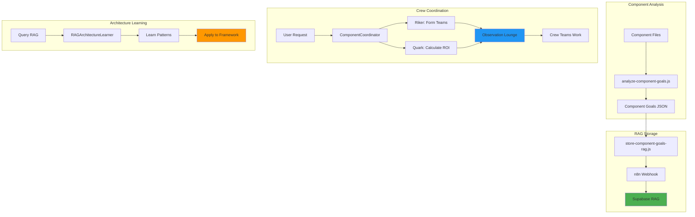

# 🖖 Dashboard Component Coordination System

**Status:** ✅ **IMPLEMENTED**  
**Date:** January 19, 2025  
**Purpose:** Enable crew coordination for all dashboard components using Riker's organization and Quark's business analytics

---

## 🎯 **OVERVIEW**

The Dashboard Component Coordination System enables the Alex AI crew to work together on optimizing and maintaining all dashboard components. It uses:

- **Commander Riker's Organization**: Groups components by domain and assigns crew teams
- **Quark's Business Analytics**: Calculates ROI and business value for component work
- **RAG Memory System**: Stores component goals and learns from architecture patterns
- **Observation Lounge**: Coordinates crew teams working on components

---

## 🏗️ **ARCHITECTURE**



---

## 📋 **COMPONENT GOALS DOCUMENTATION**

### **Analysis Process**

1. **Analyze Components**: Run `npm run analyze:components`
   - Scans all dashboard components
   - Extracts goals, responsibilities, integrations
   - Maps to domains and crew owners
   - Generates RAG-ready format

2. **Store in RAG**: Run `npm run store:component-goals`
   - Stores component goals in Supabase RAG
   - Makes goals searchable by crew members
   - Enables semantic discovery of component relationships

### **Component Goal Structure**

```typescript
interface ComponentGoal {
  componentName: string;
  purpose: string;
  responsibilities: string[];
  domain: string;
  crewOwners: string[];
  businessValue: string;
  integrations: string[];
  dataSources: string[];
  technicalDetails: {
    framework: string;
    hooks: string[];
    dependencies: string[];
  };
}
```

---

## 👥 **CREW COORDINATION**

### **Team Formation (Riker's Organization)**

Components are grouped by domain and assigned to crew teams:

- **System Health & Monitoring**: Dr. Crusher, Geordi La Forge
- **Intelligence & Learning**: Commander Data, Counselor Troi
- **Design & Theming**: Counselor Troi, Geordi La Forge
- **Project Management**: Commander Riker, Captain Picard
- **Workflow & Automation**: Commander Riker, Lieutenant Uhura
- **Security & Compliance**: Lieutenant Worf, Dr. Crusher
- **Data & Analytics**: Commander Data, Quark
- **Knowledge & Documentation**: Lieutenant Uhura, Commander Data

### **Business Analytics (Quark)**

Each component team calculates:
- **Business Value**: Based on integrations, data sources, purpose
- **ROI**: (Value - Cost) / Cost * 100
- **Priority**: High (>100 value), Medium (50-100), Low (<50)

### **Coordination Strategies**

1. **Parallel**: All teams work simultaneously (fastest)
2. **Sequential**: Teams work one after another (most controlled)
3. **Hybrid**: High priority parallel, low priority sequential (balanced)

---

## 🧠 **ARCHITECTURE LEARNING**

### **RAG Pattern Learning**

The `RAGArchitectureLearner` queries RAG for:
- **Design Patterns**: Reusable solutions to common problems
- **Anti-Patterns**: Common mistakes to avoid
- **Best Practices**: Proven approaches
- **Architecture Decisions**: Past decisions and rationale

### **Application Process**

1. **Query RAG**: Search for relevant architecture patterns
2. **Extract Patterns**: Parse patterns from crew memories
3. **Check Applicability**: Match patterns to current context
4. **Apply Patterns**: Generate recommendations and code changes

### **Example Query**

```typescript
const learner = new RAGArchitectureLearner();
const patterns = await learner.queryArchitecturePatterns(
  'component state management hydration errors'
);

const application = await learner.applyPatternsToFramework(
  patterns,
  'Next.js dashboard with client-side state'
);
```

---

## 🚀 **INSTANTIATION SYSTEM**

### **Cursor AI / VS Code Activation**

The `AlexAIInstantiation` system makes Alex AI easily activatable:

1. **Auto-Detection**: Detects IDE (Cursor AI or VS Code)
2. **Activation Prompts**: Generates ready-to-use activation prompts
3. **Chat State Persistence**: Saves and restores chat state across restarts
4. **Configuration**: Generates IDE-specific configs

### **Usage**

#### **Manual Activation**
```typescript
const alexAI = new AlexAIInstantiation({
  ide: 'cursor',
  activationMode: 'command',
  loadMemories: true,
  enableRAG: true
});

const prompt = alexAI.generateActivationPrompt();
// Copy prompt into chat
```

#### **Auto-Activation**
```typescript
const alexAI = new AlexAIInstantiation({
  activationMode: 'default',
  autoActivateTriggers: ['crew', 'alex ai', 'picard', 'data']
});

if (alexAI.shouldAutoActivate(userMessage)) {
  // Auto-activate Alex AI
}
```

#### **Chat State Persistence**
```typescript
// Save state
await alexAI.saveChatState({
  sessionId: 'session-123',
  messages: [...],
  activeCrew: ['picard', 'data', 'riker'],
  context: { project: 'dashboard', workingDirectory: '/dashboard' }
});

// Load state after restart
const state = await alexAI.loadChatState();
```

---

## 📊 **WORKFLOW**

### **Complete Component Coordination Flow**

1. **Analyze Components**
   ```bash
   npm run analyze:components
   ```

2. **Store Goals in RAG**
   ```bash
   npm run store:component-goals
   ```

3. **Coordinate Component Updates**
   ```typescript
   const coordinator = new ComponentCoordinator();
   await coordinator.loadComponentGoals(goals);
   
   const plan = coordinator.createCoordinationPlan(
     'Optimize dashboard components for better performance',
     ['AnalyticsDashboard', 'ProjectGrid', 'ThemeSelector'],
     'parallel'
   );
   
   const results = await coordinator.executeCoordinationPlan(plan);
   ```

4. **Learn from Architecture**
   ```typescript
   const learner = new RAGArchitectureLearner();
   const patterns = await learner.queryArchitecturePatterns(
     'component reactivity state management'
   );
   
   const application = await learner.applyPatternsToFramework(
     patterns,
     'React dashboard components'
   );
   ```

---

## 🎯 **BEST PRACTICES**

1. **Document Component Goals**: Always run analysis after adding new components
2. **Store in RAG**: Make component goals searchable for crew learning
3. **Use Crew Coordination**: Leverage Riker's organization and Quark's analytics
4. **Learn from Patterns**: Query RAG for architecture patterns before implementing
5. **Persist Chat State**: Save chat state before restarting IDE

---

## 🔧 **CONFIGURATION**

### **Package.json Scripts**

```json
{
  "scripts": {
    "analyze:components": "node scripts/analyze-component-goals.js",
    "store:component-goals": "node scripts/store-component-goals-rag.js",
    "alex-ai:activate": "node scripts/activate-alex-ai.js",
    "alex-ai:status": "node scripts/alex-ai-status.js"
  }
}
```

### **Environment Variables**

```bash
N8N_WEBHOOK_URL=https://n8n.pbradygeorgen.com/webhook/knowledge-ingest
NEXT_PUBLIC_SUPABASE_URL=your-supabase-url
NEXT_PUBLIC_SUPABASE_ANON_KEY=your-supabase-key
```

---

## 📚 **RELATED DOCUMENTATION**

- [Crew Management System](./CREW-MANAGEMENT-SYSTEM.md)
- [RAG Documentation System](./RAG_DOCUMENTATION_SYSTEM.md)
- [Observation Lounge](./CREW_OBSERVATION_LOUNGE.md)
- [Component Goals Analysis](../docs/component-goals/summary.json)

---

**🖖 Engage the crew to coordinate component updates!**

