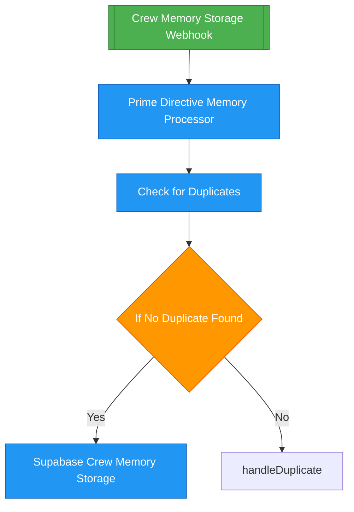

# n8n to Mermaid Visualization Integration

**Status:** ✅ Research Complete | 🔄 Implementation In Progress  
**Reviewed by:** Commander Data (Technical) & Lt. Uhura (Integration)

---

## 📊 Overview

This document outlines the integration of n8n workflow visualization using Mermaid diagrams. The system converts n8n workflow JSON structures into Mermaid flowchart diagrams for better visualization and documentation.

---

## 🔍 Research Findings

### Web Research Results

1. **GitHub Project: n8nmermaid**
   - Repository: `github.com/jwa91/n8nmermaid`
   - Live demo: `n8nmermaid.janwillemaltink.com`
   - Community discussion: `community.n8n.io/t/n8n-workflow-to-mermaid-diagram-converter/109890`

2. **n8n Workflow Structure**
   - JSON format with `nodes` and `connections`
   - Nodes contain: `id`, `name`, `type`, `position`, `parameters`
   - Connections map node names to output arrays

3. **Mermaid Format**
   - Text-based diagram syntax
   - Supports flowcharts, sequence diagrams, state diagrams
   - Can be rendered in markdown, HTML, and React components

---

## 🏗️ Architecture

### Converter Class

**Location:** `lib/n8n-to-mermaid-converter.js`

**Key Methods:**
- `convert(workflow)` - Main conversion method
- `processNodes(nodes)` - Convert nodes to Mermaid syntax
- `processConnections(connections, nodes)` - Convert connections to edges
- `getNodeShape(node)` - Determine Mermaid shape based on node type
- `addStyling(nodes)` - Add CSS classes for node types

### Node Type Mapping

| n8n Node Type | Mermaid Shape | Color |
|--------------|---------------|-------|
| `trigger`, `webhook`, `cron` | `(((` (circle) | Green |
| `if`, `switch`, `condition` | `{` (diamond) | Orange |
| `error`, `catch` | `>` (hexagon) | Red |
| Default (action nodes) | `[` (rectangle) | Blue |

### Connection Mapping

- **Main connections:** `-->` (solid arrow)
- **Error connections:** `-.->|error|` (dashed arrow with label)
- **Conditional branches:** `-->|condition|` (labeled arrow)

---

## 🚀 Implementation

### 1. Converter Library

```javascript
const N8NToMermaidConverter = require('./lib/n8n-to-mermaid-converter');
const converter = new N8NToMermaidConverter();

const workflow = JSON.parse(fs.readFileSync('workflow.json', 'utf8'));
const mermaid = converter.convert(workflow);
```

### 2. Test Script

**Location:** `scripts/test-n8n-mermaid-converter.js`

Tests the converter with real n8n workflow files and generates `.mmd` files in `docs/mermaid-workflows/`.

### 3. Web Scraping Tool

**Location:** `scripts/web-scrape-n8n-mermaid-examples.js`

Scrapes web resources to find examples and documentation about n8n to Mermaid conversion.

### 4. Research Script

**Location:** `scripts/research-n8n-mermaid-integration.js`

Analyzes n8n workflow structure, Mermaid format, and creates conversion strategy.

---

## 📝 Usage Examples

### Basic Conversion

```javascript
const converter = new N8NToMermaidConverter();
const mermaid = converter.convert(workflowJson);
console.log(mermaid);
```

### Generated Mermaid Output



---

## 🎯 Integration Points

### Dashboard Component

**Existing:** `dashboard/components/Mermaid.tsx`

The dashboard already has a Mermaid component that can render diagrams. We can:

1. Create an API endpoint to convert n8n workflows
2. Add a workflow visualization page
3. Integrate with n8n workflow viewer

### API Endpoint (Future)

```typescript
// dashboard/app/api/workflows/[id]/mermaid/route.ts
export async function GET(request: Request, { params }: { params: { id: string } }) {
  const workflow = await fetchN8NWorkflow(params.id);
  const converter = new N8NToMermaidConverter();
  const mermaid = converter.convert(workflow);
  return Response.json({ mermaid });
}
```

---

## 📊 Test Results

Run the test script to see conversion results:

```bash
node scripts/test-n8n-mermaid-converter.js
```

This will:
1. Find all `.json` workflow files in `n8n-workflows/`
2. Convert them to Mermaid format
3. Save `.mmd` files in `docs/mermaid-workflows/`

---

## 🔄 Next Steps

1. ✅ **Research Complete** - Analyzed n8n structure and Mermaid format
2. ✅ **Converter Created** - Basic conversion functionality
3. ✅ **Test Script** - Automated testing with real workflows
4. 🔄 **Dashboard Integration** - Add workflow visualization page
5. ⏳ **API Endpoint** - On-the-fly conversion endpoint
6. ⏳ **Live Updates** - Real-time workflow visualization
7. ⏳ **Export Feature** - Download Mermaid diagrams

---

## 📚 Resources

- **n8n Documentation:** https://docs.n8n.io/workflows/
- **Mermaid Documentation:** https://mermaid.js.org/syntax/flowchart.html
- **GitHub Project:** https://github.com/jwa91/n8nmermaid
- **Community Discussion:** https://community.n8n.io/t/n8n-workflow-to-mermaid-diagram-converter/109890

---

## 🛡️ Security Considerations

- Converter only processes workflow structure (no execution)
- No external API calls during conversion
- Safe to use with untrusted workflow JSON (read-only)

---

**Last Updated:** 2025-01-18  
**Status:** Research & Basic Implementation Complete

