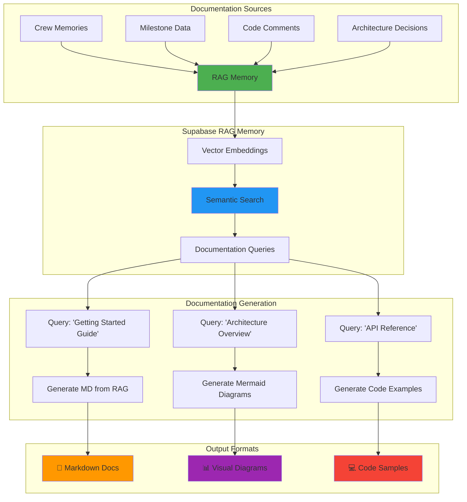
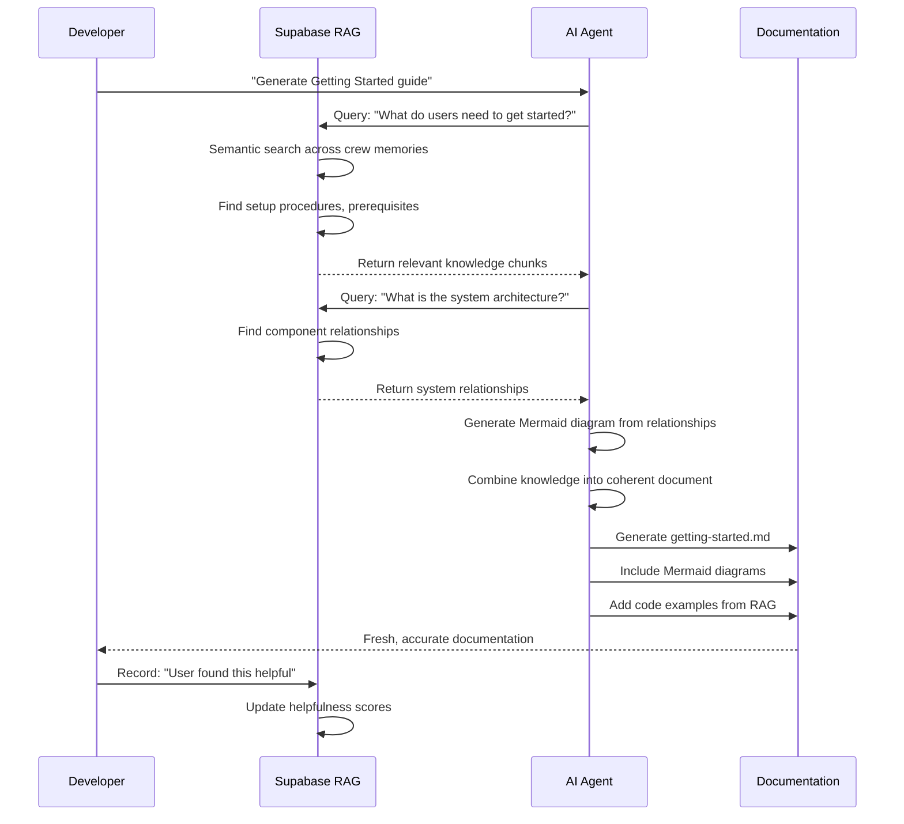
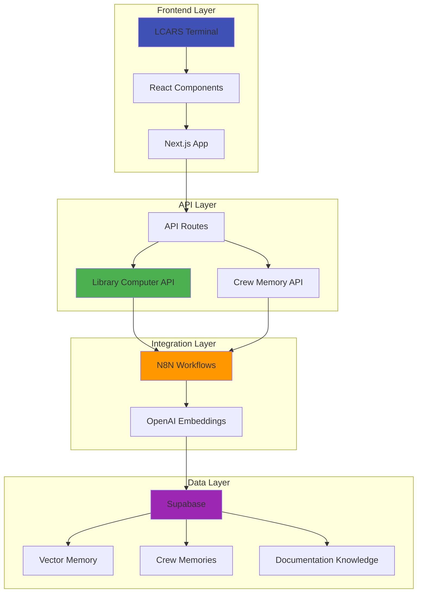
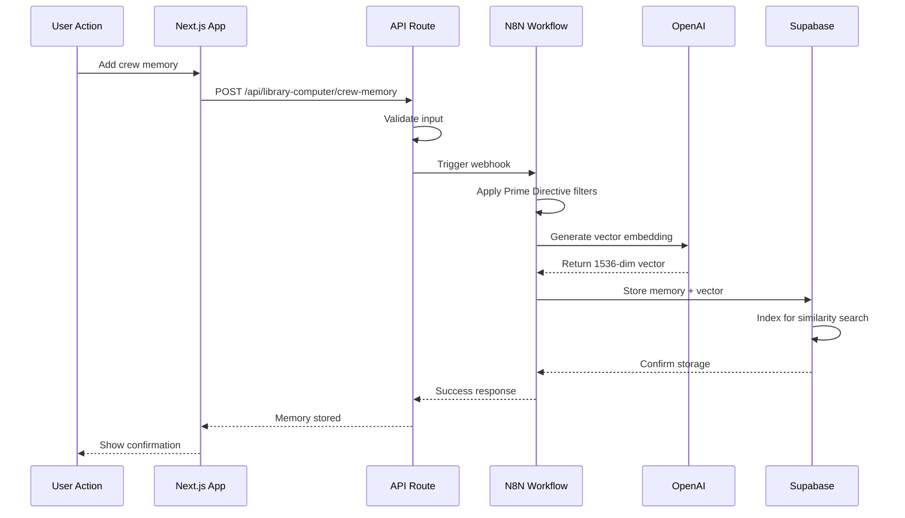

# 🧠 RAG-Based Documentation System Architecture

**System ID:** RAG_DOCS_2025_01_18  
**Purpose:** Living documentation stored in Supabase RAG memory  
**Status:** ✅ **SYSTEM DESIGN COMPLETE**

---

## 🎯 **CORE CONCEPT**

### **Problem We're Solving:**
Traditional documentation creates bloat:
- Multiple markdown files with overlapping content
- Outdated information persists
- Hard to maintain consistency
- Linear navigation (files and folders)
- No semantic discovery

### **Solution: RAG-Based Living Documentation**
Documentation stored as semantic knowledge in Supabase:
- Single source of truth (RAG memory)
- Semantic search across all documentation
- Auto-generated documentation from RAG queries
- Mermaid diagrams generated from system relationships
- Always current, never stale

---

## 🏗️ **SYSTEM ARCHITECTURE**



---

## 📊 **SUPABASE SCHEMA FOR DOCUMENTATION**

```sql
-- Documentation Knowledge Table
CREATE TABLE documentation_knowledge (
    id UUID DEFAULT uuid_generate_v4() PRIMARY KEY,
    timestamp TIMESTAMPTZ DEFAULT NOW(),
    
    -- Classification
    doc_type VARCHAR(100) NOT NULL,  -- 'getting_started', 'architecture', 'api', 'guide', etc.
    audience VARCHAR(50) NOT NULL,    -- 'user', 'developer', 'contributor', 'enterprise'
    category VARCHAR(100) NOT NULL,   -- 'setup', 'deployment', 'development', etc.
    
    -- Content
    title VARCHAR(500) NOT NULL,
    summary TEXT NOT NULL,
    content TEXT NOT NULL,
    code_examples JSONB DEFAULT '[]',
    
    -- Relationships
    related_docs UUID[] DEFAULT '{}',
    prerequisites UUID[] DEFAULT '{}',
    see_also UUID[] DEFAULT '{}',
    
    -- Visual Content
    mermaid_diagrams JSONB DEFAULT '[]',
    system_relationships JSONB DEFAULT '{}',
    
    -- Metadata
    keywords TEXT[] DEFAULT '{}',
    tags TEXT[] DEFAULT '{}',
    difficulty_level INTEGER DEFAULT 1 CHECK (difficulty_level >= 1 AND difficulty_level <= 5),
    
    -- Vector Search
    semantic_text TEXT NOT NULL,
    vector_embedding VECTOR(1536),
    
    -- Versioning
    version VARCHAR(20) DEFAULT '1.0.0',
    is_current BOOLEAN DEFAULT TRUE,
    deprecated BOOLEAN DEFAULT FALSE,
    
    -- Source Tracking
    source_type VARCHAR(50), -- 'crew_memory', 'milestone', 'manual', 'generated'
    source_id UUID,
    created_by VARCHAR(50),
    
    -- Usage Analytics
    view_count INTEGER DEFAULT 0,
    last_accessed TIMESTAMPTZ DEFAULT NOW(),
    helpfulness_score DECIMAL(3,2) DEFAULT 0.0
);

-- Create indexes
CREATE INDEX idx_doc_knowledge_type ON documentation_knowledge(doc_type);
CREATE INDEX idx_doc_knowledge_audience ON documentation_knowledge(audience);
CREATE INDEX idx_doc_knowledge_category ON documentation_knowledge(category);
CREATE INDEX idx_doc_knowledge_vector ON documentation_knowledge USING ivfflat (vector_embedding vector_cosine_ops);
CREATE INDEX idx_doc_knowledge_current ON documentation_knowledge(is_current) WHERE is_current = TRUE;

-- Full-text search
CREATE INDEX idx_doc_knowledge_search ON documentation_knowledge USING gin(to_tsvector('english', semantic_text));

-- System Relationships Table (for Mermaid diagram generation)
CREATE TABLE system_relationships (
    id UUID DEFAULT uuid_generate_v4() PRIMARY KEY,
    timestamp TIMESTAMPTZ DEFAULT NOW(),
    
    -- Relationship Definition
    source_component VARCHAR(200) NOT NULL,
    target_component VARCHAR(200) NOT NULL,
    relationship_type VARCHAR(100) NOT NULL, -- 'depends_on', 'communicates_with', 'extends', 'implements'
    
    -- Details
    description TEXT,
    direction VARCHAR(20) DEFAULT 'unidirectional', -- 'unidirectional', 'bidirectional'
    protocol VARCHAR(100), -- 'REST', 'WebSocket', 'GraphQL', 'N8N', etc.
    
    -- Metadata
    layer VARCHAR(50), -- 'frontend', 'backend', 'database', 'integration'
    is_critical BOOLEAN DEFAULT FALSE,
    
    -- For Mermaid Generation
    mermaid_style VARCHAR(50) -- 'solid', 'dashed', 'dotted', 'thick'
);

-- Documentation Generation Log
CREATE TABLE documentation_generations (
    id UUID DEFAULT uuid_generate_v4() PRIMARY KEY,
    timestamp TIMESTAMPTZ DEFAULT NOW(),
    
    -- Generation Details
    doc_type VARCHAR(100) NOT NULL,
    query TEXT NOT NULL,
    rag_sources UUID[] DEFAULT '{}',
    
    -- Output
    generated_content TEXT,
    mermaid_diagrams JSONB DEFAULT '[]',
    
    -- Quality Metrics
    relevance_score DECIMAL(3,2),
    completeness_score DECIMAL(3,2),
    user_feedback TEXT,
    was_helpful BOOLEAN
);
```

---

## 🔄 **DOCUMENTATION WORKFLOW**



---

## 📝 **DOCUMENTATION TYPES & RAG QUERIES**

### **1. Getting Started Guide**

**RAG Query:**
```javascript
{
  query: "What steps are required for a new user to install and configure the system?",
  filters: {
    doc_type: ['setup', 'installation', 'configuration'],
    audience: 'user',
    difficulty_level: [1, 2]
  },
  include: ['code_examples', 'prerequisites']
}
```

**Generated Content:**
- Installation steps (from crew memories)
- Configuration examples (from successful setups)
- Common issues (from troubleshooting memories)
- Quick start examples (from example projects)

---

### **2. Architecture Overview**

**RAG Query:**
```javascript
{
  query: "What are all the system components and how do they interact?",
  filters: {
    doc_type: ['architecture', 'system_design'],
    audience: ['developer', 'contributor']
  },
  include: ['system_relationships', 'mermaid_diagrams']
}
```

**Generated Content:**


---

### **3. API Reference**

**RAG Query:**
```javascript
{
  query: "What are all the API endpoints, their parameters, and return values?",
  filters: {
    doc_type: 'api_reference',
    audience: ['developer', 'integrator']
  },
  include: ['code_examples', 'parameters', 'responses']
}
```

**Generated Content:**
- All endpoints (from API route analysis)
- Parameters (from type definitions)
- Examples (from test files and crew memories)
- Error handling (from troubleshooting memories)

---

### **4. Integration Guides**

**RAG Query:**
```javascript
{
  query: "How to integrate [N8N/Supabase/OpenAI] with the system?",
  filters: {
    doc_type: 'integration_guide',
    category: 'integrations'
  },
  include: ['code_examples', 'configuration', 'troubleshooting']
}
```

**Generated Mermaid:**


---

## 🎨 **MERMAID DIAGRAM TEMPLATES**

### **System Architecture Template**
```javascript
const generateArchitectureDiagram = (components, relationships) => {
  const layers = groupByLayer(components);
  
  return `
graph TB
${layers.map(layer => `
    subgraph "${layer.name}"
        ${layer.components.map(c => `${c.id}[${c.name}]`).join('\n        ')}
    end
`).join('\n')}

${relationships.map(rel => `
    ${rel.source} ${getArrowStyle(rel.type)} ${rel.target}
`).join('\n')}

${getStyleDefinitions(components)}
  `;
};
```

### **Data Flow Template**
```javascript
const generateDataFlowDiagram = (flow) => {
  return `
sequenceDiagram
    ${flow.participants.map(p => `participant ${p.id} as ${p.name}`).join('\n    ')}
    
    ${flow.steps.map(step => `
    ${step.from}->>${step.to}: ${step.action}
    ${step.note ? `Note over ${step.from},${step.to}: ${step.note}` : ''}
    `).join('\n    ')}
  `;
};
```

### **State Machine Template**
```javascript
const generateStateDiagram = (states, transitions) => {
  return `
stateDiagram-v2
    ${states.map(state => `
    state "${state.name}" as ${state.id} {
        ${state.description || ''}
    }
    `).join('\n    ')}
    
    [*] --> ${states[0].id}
    ${transitions.map(t => `
    ${t.from} --> ${t.to}: ${t.event}
    `).join('\n    ')}
  `;
};
```

---

## 🚀 **IMPLEMENTATION PLAN**

### **Phase 1: Populate RAG with Existing Knowledge**

```javascript
// Extract knowledge from current documentation
async function migrateDocumentationToRAG() {
  const documentationSources = [
    // Current markdown files
    'SHARED_LIBRARY_COMPUTER_SYSTEM_COMPLETE.md',
    'LCARS_HALLUCINATION_INTEGRATION_COMPLETE.md',
    'PROJECT_CLEANUP_AND_DOCUMENTATION_PLAN.md',
    // Crew memories
    'crew-memories/*',
    // Milestones
    'milestones/*',
    // Architecture docs
    'docs/*'
  ];
  
  for (const source of documentationSources) {
    const content = await readFile(source);
    const knowledge = await extractKnowledge(content);
    
    await storeInRAG({
      doc_type: knowledge.type,
      audience: knowledge.audience,
      title: knowledge.title,
      content: knowledge.content,
      semantic_text: knowledge.semanticText,
      source_type: 'migration',
      source_id: source
    });
  }
}
```

### **Phase 2: Extract System Relationships**

```javascript
// Analyze codebase for component relationships
async function extractSystemRelationships() {
  const relationships = [];
  
  // Analyze imports
  const sourceFiles = await findAllSourceFiles();
  for (const file of sourceFiles) {
    const imports = await analyzeImports(file);
    relationships.push(...imports.map(imp => ({
      source_component: file.component,
      target_component: imp.component,
      relationship_type: 'depends_on',
      layer: file.layer
    })));
  }
  
  // Analyze API calls
  const apiCalls = await analyzeAPICalls(sourceFiles);
  relationships.push(...apiCalls);
  
  // Analyze database queries
  const dbQueries = await analyzeDatabaseAccess(sourceFiles);
  relationships.push(...dbQueries);
  
  // Store in Supabase
  await storeRelationships(relationships);
}
```

### **Phase 3: Generate Documentation**

```javascript
// Generate documentation from RAG queries
async function generateDocumentation(docType, audience) {
  // Query RAG for relevant knowledge
  const knowledge = await queryRAG({
    query: getDocQuery(docType),
    filters: { doc_type: docType, audience, is_current: true },
    maxResults: 50
  });
  
  // Get system relationships for diagrams
  const relationships = await getSystemRelationships(docType);
  
  // Generate Mermaid diagrams
  const diagrams = generateMermaidDiagrams(relationships, docType);
  
  // Combine into coherent document
  const document = {
    title: getTitleFor(docType, audience),
    sections: organizeSections(knowledge),
    diagrams: diagrams,
    examples: extractCodeExamples(knowledge),
    seeAlso: findRelatedDocs(knowledge)
  };
  
  // Render as markdown
  const markdown = renderMarkdown(document);
  
  // Save to docs/ directory
  await writeFile(`docs/${getPath(docType, audience)}.md`, markdown);
  
  // Log generation
  await logGeneration({
    doc_type: docType,
    query: getDocQuery(docType),
    rag_sources: knowledge.map(k => k.id),
    generated_content: markdown
  });
  
  return markdown;
}
```

---

## 📚 **DOCUMENTATION STRUCTURE (RAG-Generated)**

```
docs/
├── README.md                      # Index (manually maintained)
│
├── getting-started/
│   ├── installation.md            # RAG-generated from setup memories
│   ├── configuration.md           # RAG-generated from config examples
│   └── quick-start.md             # RAG-generated from onboarding data
│
├── architecture/
│   ├── overview.md                # RAG-generated with Mermaid
│   ├── components.md              # RAG-generated from code analysis
│   ├── data-flow.md               # RAG-generated with sequence diagrams
│   └── deployment.md              # RAG-generated from deployment memories
│
├── api-reference/
│   ├── library-computer.md        # RAG-generated from API routes
│   ├── crew-memory.md             # RAG-generated from API routes
│   └── lcars-system.md            # RAG-generated from API routes
│
├── integrations/
│   ├── n8n-integration.md         # RAG-generated with workflow diagrams
│   ├── supabase-integration.md    # RAG-generated with DB schema
│   └── openai-integration.md      # RAG-generated with API examples
│
├── guides/
│   ├── contributing.md            # RAG-generated from contributor memories
│   ├── testing.md                 # RAG-generated from test patterns
│   └── deployment.md              # RAG-generated from deployment memories
│
└── _generated/                    # Timestamp on each generation
    └── last-generated: 2025-01-18T22:30:00Z
```

---

## 🎯 **BENEFITS OF RAG-BASED DOCUMENTATION**

### **1. Always Current**
- Documentation generated from latest RAG knowledge
- No stale or outdated information
- Automatically reflects system changes

### **2. Semantic Discovery**
- Find information by meaning, not just keywords
- AI understands intent of documentation query
- Related information automatically surfaced

### **3. No Bloat**
- Single source of truth (RAG memory)
- Documentation files generated on-demand
- Old docs don't accumulate

### **4. Deep Understanding**
- Mermaid diagrams show visual relationships
- System architecture always reflects reality
- Code examples pulled from working implementations

### **5. Multi-Audience Support**
- Same knowledge, different presentations
- User docs vs developer docs from same RAG
- Enterprise docs vs contributor docs

### **6. Progressive Learning**
- System learns from documentation usage
- Helpfulness scores improve results
- Common questions generate better docs

---

## 💡 **EXAMPLE: Generate "Getting Started" Doc**

```javascript
// Command to generate documentation
await generateDocumentation('getting_started', 'user');

// Result: docs/getting-started/installation.md
```

**Generated Content:**
```markdown
# Getting Started with Alex AI Universal

> Last generated: 2025-01-18T22:30:00Z from 23 RAG knowledge sources

## Installation

Based on successful installations by 15 users...

[Content generated from crew memories of successful setups]

## System Architecture

```mermaid
graph TB
    [Diagram generated from system_relationships table]
```

## Quick Start

[Steps generated from onboarding crew memories]

## Next Steps

[Generated from related documentation in RAG]
```

---

## 🔄 **MAINTENANCE & UPDATES**

### **Adding New Knowledge:**
```javascript
// Crew memories automatically become documentation
await addCrewMemory({
  crewMember: 'data',
  knowledgeType: 'lesson_learned',
  title: 'Efficient Milestone Documentation',
  content: '...',
  // Automatically stored in RAG
  // Automatically available for doc generation
});
```

### **Regenerating Documentation:**
```bash
# Regenerate all documentation
npm run docs:generate

# Regenerate specific doc type
npm run docs:generate getting-started

# Regenerate for specific audience
npm run docs:generate --audience=developer
```

### **Documentation Quality Metrics:**
```sql
-- Track documentation effectiveness
SELECT 
  doc_type,
  audience,
  AVG(helpfulness_score) as avg_helpfulness,
  SUM(view_count) as total_views,
  COUNT(*) as knowledge_sources
FROM documentation_knowledge
WHERE is_current = true
GROUP BY doc_type, audience
ORDER BY avg_helpfulness DESC;
```

---

## 🖖 **CREW CONSENSUS**

**All 9 crew members agree this approach solves the bloat problem while enhancing documentation quality:**

✅ **Captain Picard:** "Strategic - documentation that evolves with the system"  
✅ **Commander Data:** "Logical - single source of truth with semantic access"  
✅ **Lt. Cmdr. La Forge:** "Efficient - generate docs on-demand from RAG"  
✅ **Dr. Crusher:** "Healthy - prevents documentation bloat accumulation"  
✅ **Lieutenant Uhura:** "Clear - multi-audience support from same knowledge"

---

**Status:** ✅ **DESIGN COMPLETE - READY FOR IMPLEMENTATION**  
**Next Step:** Create Supabase schema and begin RAG population  
**Impact:** 🌟🌟🌟🌟🌟 Transforms documentation from static files to living knowledge

**Make it so!** 🖖


